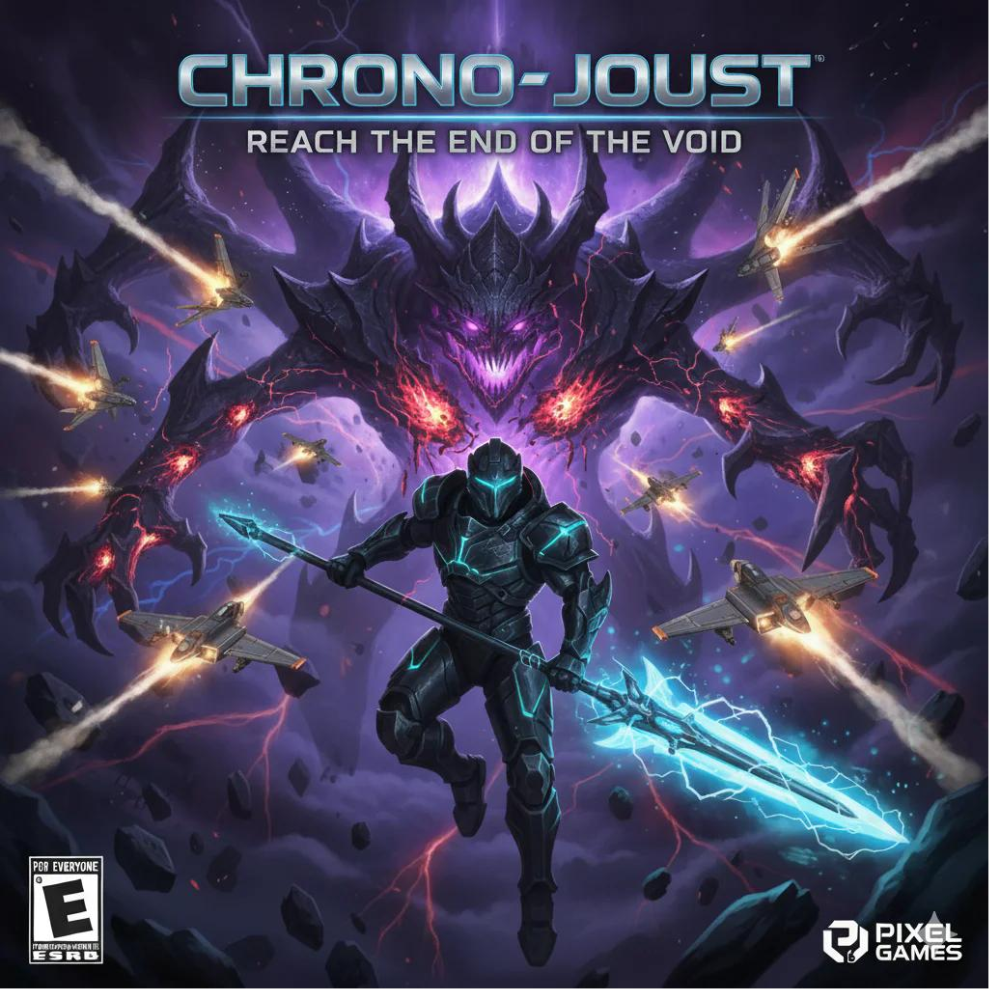

# ChronoJoust

A cyberpunk-themed side-scrolling platformer game built with React and HTML5 Canvas. Battle through four corrupted realms as the last Chrono Knight to prevent reality's end.

Game concept and design by Eddie, with help from Ben using Claude to do the coding.



## 🎮 Play Now

[Play ChronoJoust on GitHub Pages](https://kenbennedy.github.io/chronojoust/)


## 🌟 Features

- **4 Unique Levels**: Each with distinct themes, enemies, and challenges
  - Level 1: The Void - Face Glaima, the Shadow Bat
  - Level 2: Crimson Wastes - Battle The Guardian, the Demon Eye
  - Level 3: Crystal Caverns - Defeat Arachnis, the Crystal Spider
  - Level 4: Frozen Tundra - Confront Frostbane, the Demon Lord

- **Dynamic Combat System**: 
  - Melee spear attacks with physical thrust animations
  - Energy-based abilities (heal, speed boost, companion drone)
  - Multi-hit enemies and strategic boss battles

- **Unique Enemy Types**:
  - Drifters, Echoes, Droppers, Golems, Slugs, Spiders, Wraiths, and Hooded Figures
  - Each with distinct behaviors and attack patterns

- **Progression System**: Collect energy orbs to unlock powerful abilities

## 🎯 Controls

- **Arrow Keys / A, D**: Move left and right
- **Space / Up Arrow**: Jump
- **F**: Attack with spear
- **H**: Heal (costs 2 energy)
- **S**: Speed Boost (costs 2 energy)
- **C**: Summon Companion Drone (costs 5 energy)

## 🚀 Deploying to GitHub Pages

### Step 1: Create a GitHub Repository

1. Go to [GitHub](https://github.com) and create a new repository
2. Name it `chronojoust` (or any name you prefer)
3. Make it public
4. Don't initialize with README (we already have one)

### Step 2: Upload Files

You need to upload these files to your repository:

- `index.html` - Main HTML file
- `ChronoJoust.jsx` - Game code
- `ChronoJoust_cover_art.png` - Cover art/favicon
- `README.md` - This file

**Option A: Via GitHub Web Interface**
1. Click "uploading an existing file"
2. Drag and drop all files
3. Commit the changes

**Option B: Via Git Command Line**
```bash
# Initialize git in your project folder
git init

# Add all files
git add .

# Commit
git commit -m "Initial commit - ChronoJoust game"

# Add your GitHub repository as remote
git remote add origin https://github.com/YOUR_USERNAME/chronojoust.git

# Push to GitHub
git branch -M main
git push -u origin main
```

### Step 3: Enable GitHub Pages

1. Go to your repository on GitHub
2. Click **Settings** (top menu)
3. Scroll down to **Pages** (left sidebar)
4. Under "Source", select **main** branch
5. Click **Save**

GitHub will provide you with a URL like: `https://YOUR_USERNAME.github.io/chronojoust/`

### Step 4: Wait and Play!

- GitHub Pages typically takes 1-5 minutes to deploy
- Visit your URL and the game should load
- Share the link with friends!

## 🛠️ Local Development

To run locally, you need a local web server because browsers block loading local files via `file://` protocol.

**Option 1: Python**
```bash
# Python 3
python -m http.server 8000

# Then visit: http://localhost:8000
```

**Option 2: Node.js**
```bash
# Install http-server globally
npm install -g http-server

# Run server
http-server

# Visit: http://localhost:8080
```

**Option 3: VS Code**
- Install "Live Server" extension
- Right-click `index.html` → "Open with Live Server"

## 📋 System Requirements

- Modern web browser (Chrome, Firefox, Safari, Edge)
- JavaScript enabled
- Minimum screen resolution: 1280x800

## 🎨 Credits

- Game Design & Development: ChronoJoust Team
- Built with React 18 and HTML5 Canvas
- Cover art generated with AI assistance

## 📝 License

This project is open source and available for educational purposes.

## 🐛 Known Issues

- None currently! Report issues on the GitHub repository.

## 🔄 Updates

Check the repository for the latest version and updates.

---

**Enjoy your journey through the void, Chrono Knight! ⚔️**
